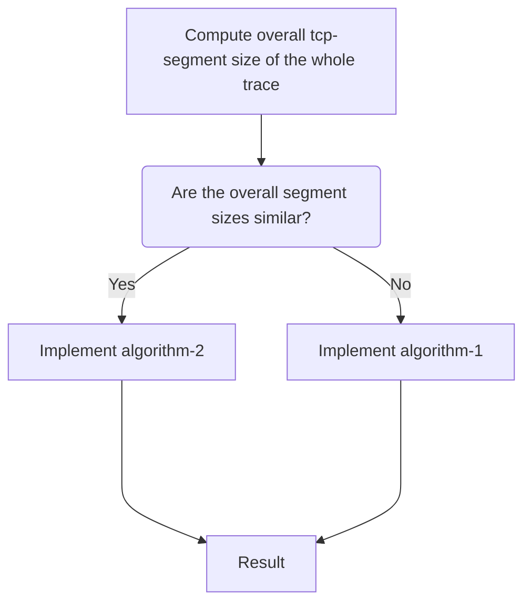

# Hybrid algorithm

We will be having 2 pcap files

1. Compute the overall tcp-segment size of the whole traces.
2. Compare the overall tcp-segment sizes of the two traces.
3. If both are similar then, Implement algorithm-2 else algorithm-1.

## Points to note:

- Sir, in algorithm-2 we **re-shaped the trace to fit correctly**. 

  

- Result of algorithm-1 which uses the sample and redistribution mechanism highly depends on the overall tcp-segment size hence, if both are not similar this algorithm can differentiate easily.
- Result of algorithm-2 which divides entire trace into **n** chunks and then compare the traces doesn't depend on overall tcp-segment size, hence if use that for non-similar traces we might get a false positive. Hence, if we use this algorithm for similar overall tcp-segment size traces then there is a high chance that we end up getting a good result.

