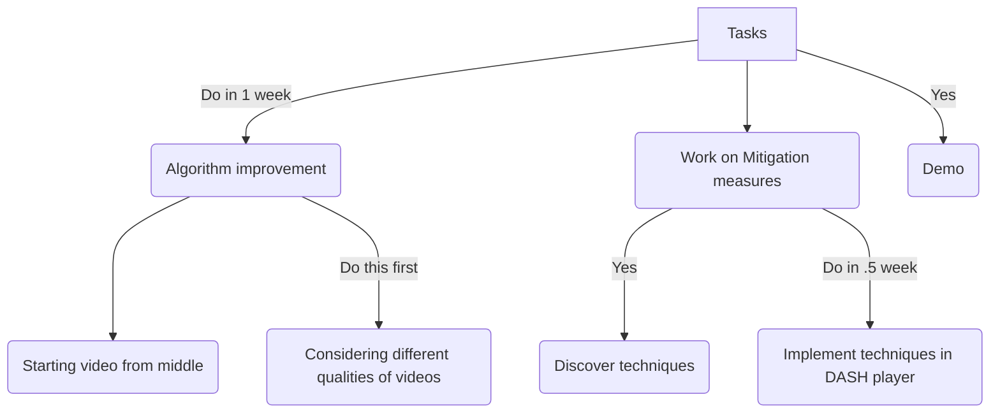

## Tasks

- Starting video from middle
- Considering different qualities of videos
- Mitigation measures
- Demo

> Time: 5 weeks - 1week(T2) = 4 weeks

## Plan

Consider 3 weeks + 1 week(Leaving for in case of worst cases)

- Mitigation Techniques - 1.5 weeks
  - Discover techniques,  1 weeks
  - Implement them in code - .5 week
- Work on implementation in DASH player / Improve algorithm - .5 week (Do in groups)
- Parallel building of dataset - 2 weeks - 14 days - 90 videos minimum => 13 videos in 2 days
- Demo, Report and PPT - 1 week

**Group work**

- Group-1: Improve algorithm 1 week, Mitigation Techniques - 1 week

- Group-2: Discover mitigation Techniques 1.5 week and Implementation .5 week

> Demo can be made in canva.com

## Plan Date wise

- 26th - 3rd Discovering techniques.
- 4-6 Exam preparation.
- 7-9 Exams
- 10-15 Work on discovering techniques and implementation.
- 16-19 Implementation in DASH player and improving algorithm.
- 20-26 Demo, report and PPT.
- 27th After will be for worst case plan. (**Will be consumed if campus rejoining is there**)

